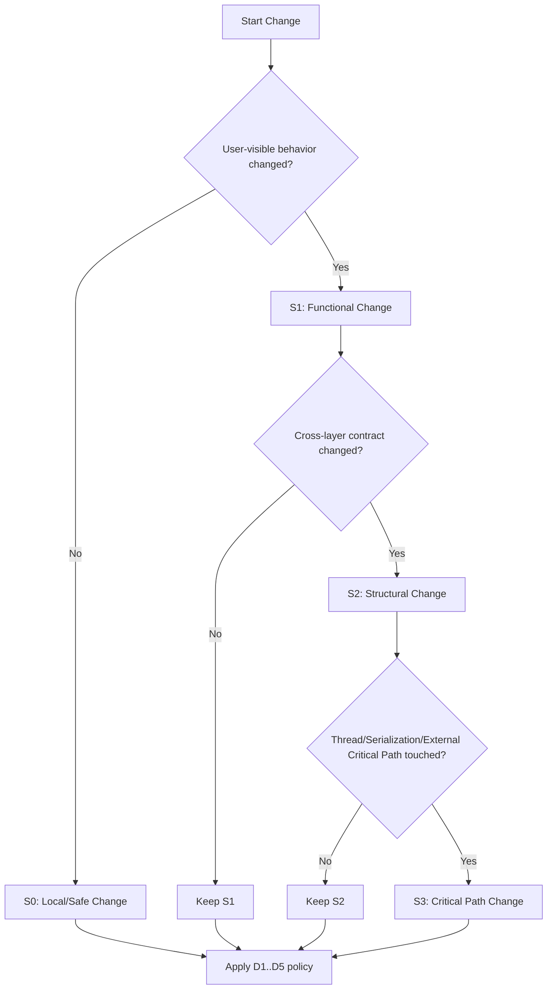
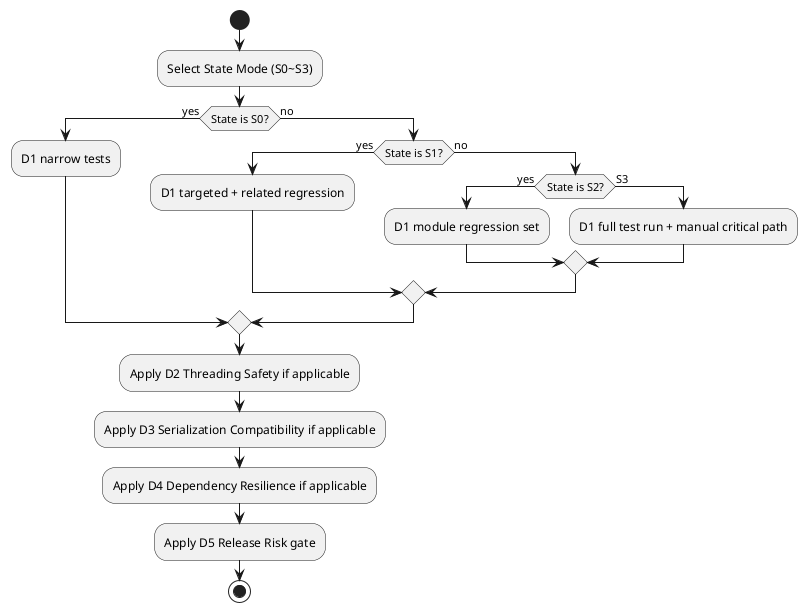

# Software Quality Decision Tree (FastMovieMaker)

This document standardizes quality decisions for feature work, bug fixes, and refactors.

## Visual Overview

## State Mode

Use `State Mode` to classify the current change before deciding actions.

### S0: Local / Safe Change
- Scope: 1-2 files, no public behavior change.
- No threading, serialization, or external dependency path changes.
- Risk: Low.
- Minimum gate: targeted unit test(s) or static check.

### S1: Functional Change
- Scope: user-visible behavior changes (UI flow, subtitle output, export behavior).
- Risk: Medium.
- Minimum gate: targeted tests + related regression tests.

### S2: Structural Change
- Scope: cross-layer changes (`services` + `workers` + `ui`), interface/type contract changes.
- Risk: Medium-High.
- Minimum gate: targeted tests + module-level regression set.

### S3: Critical Path Change
- Scope includes any of:
  - thread boundary (`QObject`, `moveToThread`, signal/slot flow),
  - project serialization/migration (`project_io`, model schema),
  - FFmpeg/Whisper/TTS error/cancel/retry paths,
  - export pipeline correctness.
- Risk: High.
- Minimum gate: full test run + manual critical-path validation.

## Decision Mode

After selecting a state, execute the matching decision policy.

### D1: Test Depth Decision
- If `S0`: run narrow tests for changed units.
- If `S1`: run narrow tests + affected integration/UI tests.
- If `S2`: run module regression set (all affected areas).
- If `S3`: run full `pytest tests/ -q` and required manual scenarios.

### D2: Threading Safety Decision
- If worker/controller/thread code changed, enforce:
  - receiver is `QObject` where queued delivery is required,
  - no GUI mutation from worker thread,
  - cancel path exits cleanly without orphan state.

### D3: Serialization Compatibility Decision
- If model/schema or `project_io` changed:
  - verify round-trip save/load,
  - verify old project compatibility (fixture or representative sample),
  - define fallback defaults for missing fields.

### D4: External Dependency Resilience Decision
- If FFmpeg/Whisper/TTS path changed:
  - verify success path,
  - verify failure path with user-actionable message,
  - verify timeout/cancel behavior and cleanup.

### D5: Release Risk Decision
- Mark `High Risk` if any of:
  - potential crash risk,
  - potential data loss,
  - potential export corruption,
  - unbounded performance regression risk.
- For `High Risk`:
  - require expanded regression coverage,
  - require at least one additional reviewer,
  - document rollback/fallback strategy in PR notes.

## Pre-Implementation Checklist

- Goal and non-goal are explicit.
- Architecture boundaries are preserved (Qt-free `services`, thread-safe controllers).
- Error messages provide concrete next action.
- Success, failure, and cancel paths are each testable.

## Pre-PR Checklist

- Required tests for selected `State Mode` have passed.
- Docs are synced if behavior/config changed.
- No obvious performance regression in hot paths.
- Platform differences considered (macOS/Windows/offscreen tests).

## Quick Rule

If uncertain between two states, choose the higher-risk state and apply the stricter decision policy.
