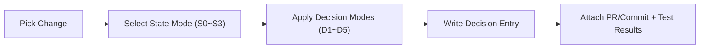
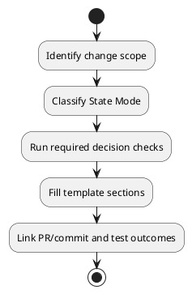

# Decision Log

This file stores concrete software-quality decisions made during development.
Use it together with `DECISION_TREE.md`:
- `DECISION_TREE.md`: how to decide.
- `DECISION_LOG.md`: what was decided and why.

## How to Use

1. Classify the change with `State Mode` (`S0`~`S3`).
2. Apply `Decision Mode` checks (`D1`~`D5`).
3. Record one entry per meaningful decision.
4. Keep entries short, testable, and traceable to PR/commit.

## Recording Flow





## Entry Template

```md
## [DL-YYYYMMDD-XX] Short Decision Title
- Date: YYYY-MM-DD
- Owner: @name
- Related PR/Commit: #PR or commit-hash
- Scope: module/path list

### Context
- What changed?
- Why is this decision needed now?

### State Mode
- Selected state: S0 | S1 | S2 | S3
- Reason:

### Decision Mode Applied
- D1 Test Depth:
- D2 Threading Safety (if applicable):
- D3 Serialization Compatibility (if applicable):
- D4 External Dependency Resilience (if applicable):
- D5 Release Risk:

### Options Considered
1. Option A:
2. Option B:
3. Option C:

### Decision
- Chosen option:
- Rationale:
- Trade-offs accepted:

### Required Tests
- [ ] Unit:
- [ ] Integration/UI:
- [ ] Full regression:
- [ ] Manual critical-path:

### Result
- Test outcome:
- Runtime/UX impact:
- Follow-up tasks:
```

## Log Entries

## [DL-20260304-01] Introduce TTS Provider Default Selection
- Date: 2026-03-04
- Owner: @team
- Related PR/Commit: (fill)
- Scope: `src/services/settings_manager.py`, `src/ui/dialogs/preferences_dialog.py`, `src/ui/dialogs/tts_dialog.py`, `src/services/tts_provider*.py`

### Context
- Added a provider abstraction for TTS and exposed default provider selection in Preferences.
- Needed to prepare plugin-ready boundaries without forcing full plugin loading in this phase.

### State Mode
- Selected state: S2
- Reason: Cross-layer change (`services` + `ui`) with behavior default changes.

### Decision Mode Applied
- D1 Test Depth: targeted + related UI regression tests.
- D2 Threading Safety: no worker-thread GUI mutation added; existing pattern kept.
- D3 Serialization Compatibility: not applicable.
- D4 External Dependency Resilience: retained existing ElevenLabs API-key validation path.
- D5 Release Risk: Medium (not marked High Risk).

### Options Considered
1. Keep engine selection only inside `TTSDialog`.
2. Add Preferences default provider, but keep dialog override.
3. Force provider globally (no dialog override).

### Decision
- Chosen option: 2
- Rationale: Improves consistency and user control while avoiding rollout risk.
- Trade-offs accepted: Provider default is not enforced globally yet.

### Required Tests
- [x] Unit: provider registry, settings default/fallback.
- [x] Integration/UI: Preferences save/load, TTSDialog default behavior.
- [x] Full regression: selected related TTS UI suites.
- [ ] Manual critical-path: optional.

### Result
- Test outcome: passing in local test run.
- Runtime/UX impact: default engine now follows Preferences.
- Follow-up tasks: optional global-provider policy for batch/segment TTS.
